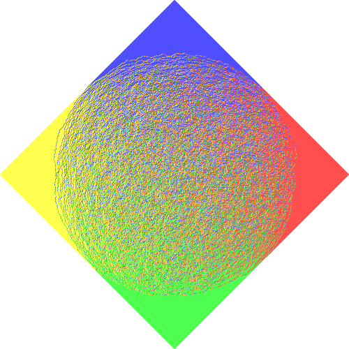

# arctic-circle

This is a simple program for illustrating random Aztec tilings for the Arctic circle theorem.
No animations for the steps performed yet, just blocky drawing that can be observed at each step.

View the tiling derivation with `(random-aztec-tiling-unfold n)` for a tiling of `A(n)`. Do not try this with large `n`.
For large tilings, such as `n = 500`, you should first construct the board `(define a500 (random-aztec-tiling 500))` and then draw it with `(board->pict a500 1000)`.
The second argument is the width in pixels the image should be.

## License

Apache v2.0